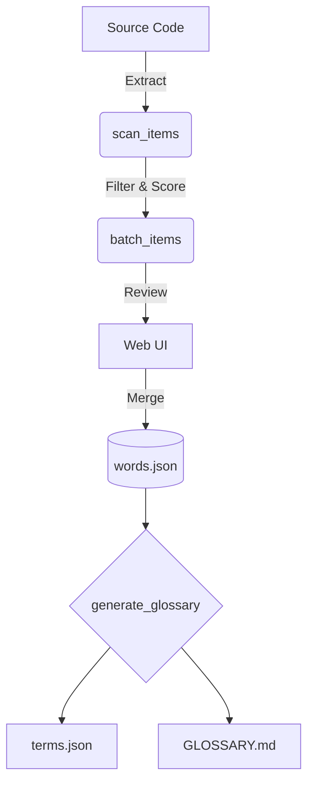

# 📖 BomTS Glossary

> AIによる自動補完と多言語対応を備えた、単語ベースの命名統制システム

**🌐 言語 (Languages):**
- 🇺🇸 [English](README.md)
- 🇰🇷 [한국어](README.ko.md)
- 🇯🇵 日本語 (Current)
- 🇨🇳 [中文](README.zh.md)

---

## ❓ これは何か？

**BomTS Glossary** は、大規模システムにおける命名の不一致を解消するための、構造的な**単語（word）ベースの命名システム**です。

以下のようなバラバラな命名を許可するのではなく：
```diff
- get_position
- fetch_position
- load_position
```

まず基準となる**「単語（コンセプト）」**を定義します：
```json
{ "word": "position" }
```

そして、その単語を用いた一貫した命名を**強制（Enforce）**します：
```diff
+ get_position
```

> **✨ The Golden Rule:** すべての識別子は、あらかじめ管理された語彙（Vocabulary）のみを用いて構成されなければなりません。

---

## 🎯 なぜ重要か？

実際の開発・大規模システムにおいて：

- ❌ 命名がプロジェクトの進行と共にバラバラになる。
- ❌ AIコーディングエージェントが、類似した概念を重複して生成する。
- ❌ コードの理解・探索が難しくなる。
- ❌ チーム内で用語のズレ（コミュニケーションロス）が発生する。

このシステムはそれらの問題を根本から解決します：

- 🔒 共通語彙の**強制**（`words.json`）
- 🤖 AIコード生成の**一貫性向上と誘導**
- 🛡️ 結合前の識別子の**自動検証（Validation）**
- 🚫 重複する命名パターンの**防止**

---

## 👥 対象ユーザー

### 🟢 誰のためのツールか？
以下に当てはまる場合に強力な効果を発揮します：
- 大規模、または長期にわたるシステムを構築している。
- AIコーディングツール（Codex, Claude, Geminiなど）を積極的に活用している。
- アーキテクチャ上、命名の一貫性が非常に重んじられる。
- 開発チーム全体でドメイン用語を標準化したい。

### 🔴 使用しない方がよい場合
以下の場合は不要な可能性があります：
- 小規模・短期のプロジェクト（簡単なスクリプトなど）。
- 単独開発であり、命名が複雑になる余地がない。
- 命名ルールに厳格な構造的要件を求めない。

---

## 🧩 コアコンセプト

システムは、以下の3つの基盤ファイルで構成されます。

| ファイル | 目的 | 編集可否 |
| --- | --- | --- |
| 🧱 `words.json` | 最小単位の基本単語 | 手動 / Web UI |
| 🧬 `compounds.json` | 特殊な複合語・略語 | 手動 / Web UI |
| 📜 `terms.json` | 自動生成される標準リスト | **編集禁止** |

> [!WARNING]  
> すべての識別子は登録済みの単語から構成されます。`terms.json` を手動で編集しないでください。

---

## 🏗️ アーキテクチャ



---

## 🚀 クイックスタート

```bash
# 検証ルールの実行とterms.jsonの生成
python glossary/bin/run.py

# 特定の識別子の検証
python glossary/generate_glossary.py check-id kill_switch
```

---

## 🖥️ Web UI

より安全で視覚的な管理を行うために、組み込みのWebサーバーを起動できます。

```bash
python glossary/web/server.py
```
> 👉 アクセス: [http://localhost:5000](http://localhost:5000)

**Web UIの主な用途:**
* 👀 バッチ抽出結果の確認。
* ✍️ JSONの構文エラーを起こさずに、安全に新規単語を登録。
* 🗃️ 用語集エントリの動的管理。

---

## 🔄 単語登録フロー

1. 識別子を **検証** します（`check-id`）。
2. 未登録単語を **特定** します。
3. （Web UI または CLI auto で）単語を **登録** します。
4. *（要件に応じて）* 特殊なケースの複合語を **登録** します。
5. 最終的な用語集を **生成（Generate）** します。

> **💡 ワークフローの例**
> `新しい識別子の登場` → `check-id` → `未登録単語を検出` → `単語を登録` → `用語集を生成` → `安全な識別子として利用可能！`

---

## 🧠 自動補完（Auto Enrichment）

単語が登録された後は、以下を実行して定義や翻訳情報を自動で補完できます。

```bash
python glossary/bin/enrich_items.py
```

補完は以下の安全なポリシーに沿って実行されます：
1. 📖 **辞書優先:** 辞書APIを通じた信頼性の高い定義。
2. 🤖 **AIフォールバック:** 辞書で解決できない場合のAI（LLM）によるサポート。
3. 🛡️ **非破壊更新:** 既存の翻訳や意味は絶対に上書きしない。

これにより、多言語サポートと信頼性の高い定義を維持しつつ、手動の作業を最小限に抑えます。

---

## 📐 設計原則

* 🧱 **単語ベース:** （term-firstではなく）単語単位に注力。
* 🔎 **辞書 → AI:** 推測より事実（Ground truth）を優先。
* 🛡️ **非破壊更新:** 既存データを保護する安全な自動化。
* 📘 **概念中心の説明:** 実装（How）ではなく概念（What）を定義。
* ⚖️ **一貫性重視:** 厳格なルールが予測可能なシステムを作る。

---

## 📌 注意事項

> [!NOTE]  
> - **CLI `auto` モード:** バッチ処理と保存（Merge）が即座に行われます。
> - 大規模なバッチ処理を安全に確認・管理するためには、**Web UI** の使用を強く推奨します。

<br>

---
*BOM_TS内部エコシステム用の管理ツールです。*