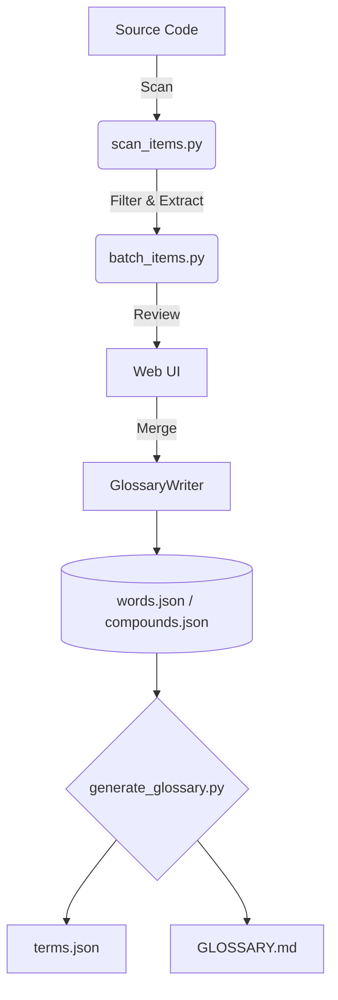

# 📖 Glossary Submodule

> 🚀 **AIによる自動補完を備えた、大規模コードベース向け単語ベース命名統制システム**

**🌐 言語 (Languages):**
- 🇺🇸 [English](README.md)
- 🇰🇷 [한국어](README.ko.md)
- 🇯🇵 日本語 (Current)
- 🇨🇳 [中文](README.zh.md)

---

## ❓ これは何か？

**Glossary サブモジュール** は、大規模システムにおける識別子命名の不一致を根本的に解消するための、構造的な**単語（word）ベースの命名システム**です。

以下のようなバラバラな命名を許可するのではなく：
```diff
- get_position
- fetch_position
- load_position
```

まず基準となる**「単一の基本概念」**を定義します：
```json
{ "id": "position" }
```

そして、その単語を用いた一貫した命名を**厳格に強制（Enforce）**します：
```diff
+ get_position
```

> **✨ The Golden Rule（黄金律）:** すべての識別子は、あらかじめ管理され登録された語彙（Vocabulary）のみを用いて構成されなければなりません。

---

## 🎯 なぜ重要か？

実際の開発・大規模システムにおいて：
- ❌ 命名がプロジェクトの進行と共にバラバラになる。
- ❌ AIコーディングエージェントが、類似した概念を重複して生成する。
- ❌ コードの理解・探索が難しくなる。
- ❌ チーム内で用語のズレ（コミュニケーションロス）が発生する。

このシステムはそれらの問題を根本から解決します：
- 🔒 共通語彙の**強制**（`words.json`）
- 🤖 AIコード生成の**一貫性向上と誘導**
- 🛡️ 結合前の識別子の**自動検証（Validation）**
- 🚫 アーキテクチャ全体での重複する命名パターンの**防止**

---

## 👥 対象ユーザー

### 🟢 誰のためのツールか？
以下に当てはまる場合に強力な効果を発揮します：
- 大規模、または長期にわたるシステムを構築している。
- AIコーディングツール（Codex, Claude, Geminiなど）を積極的に活用している。
- アーキテクチャ上、命名の一貫性が非常に重んじられる。
- 開発チーム全体でドメイン用語を標準化したい。

### 🔴 使用しない方がよい場合
以下の場合は不要な可能性があります：
- 小規模・短期のプロジェクト（簡単なスクリプトなど）。
- 単独開発であり、命名が複雑になる余地がない。
- 命名ルールに厳格な構造的要件を求めない。

---

## 🧩 コアコンセプト

システムは、以下の3つの基盤ファイルと堅牢な編集メカニズムで構成されます。

| コンポーネント | 目的 | 編集可否 |
| --- | --- | --- |
| 🧱 `words.json` | 最小単位の基本単語 | `GlossaryWriter` / Web UI |
| 🧬 `compounds.json` | 特殊な複合語・公式略語 | `GlossaryWriter` / Web UI |
| 📜 `terms.json` | 自動生成される標準リスト | **読み取り専用（手動編集禁止）** |

> [!WARNING]
> **データ整合性ルール:** `words.json` や `compounds.json` をテキストエディタで直接手動編集しないでください。適切な検証と自動バックアップを保証するため、すべての編集は必ず `core/writer.py` (`GlossaryWriter`) を介して行う必要があります。

### 派生形（Variants）
辞書に不要な単語が乱立するのを防ぐため、派生形は独立した単語としてではなく、ルート単語（root）の**派生形（variant）**として登録されます。
- **複数形 (Plurals)**: 単数形名詞に属します（例：`orders` は `order` の複数形派生として登録）。
- **略語 (Abbreviations)**: 複合語（compound）の一部として登録されます。
- **動詞の活用 (Verb Forms)**: 過去形や形容詞形（例：`reached`）は、原形動詞（`reach`）に属します。

---

## 🏗️ アーキテクチャ



---

## 🚀 クイックスタート

環境のセットアップが完了したら、以下のコマンドで用語の検証と生成を一括で行うことができます：

```bash
# 検証ルールの実行とterms.jsonの生成
python glossary/bin/run.py

# 特定の識別子が辞書に適合しているか検証
python glossary/generate_glossary.py check-id kill_switch
```

---

## 🖥️ Web UI

より安全で視覚的な管理を行うために、組み込みのWebサーバーを起動してください：

```bash
python glossary/web/server.py
```
> 👉 アクセス: [http://localhost:5000](http://localhost:5000)

**Web UIの主な用途:**
* 👀 バッチ抽出（コードスキャン）結果の確認。
* ✍️ JSONの構文エラーを起こさずに、安全に新規単語を登録。
* 🗃️ 用語集エントリの動的管理。

---

## 🔄 単語登録フロー

1. **検証 (Test)**: 識別子を検証します（`check-id`）。
2. **特定 (Identify)**: 未登録単語を特定します。
3. **登録 (Register)**: （Web UI または CLI auto で）単語を登録します。
4. *（任意）* **複合語の登録**: 特殊なケースの複合語を登録します。
5. **生成 (Generate)**: 最終的な用語集を生成します。

---

## 🧠 自動補完とコードスキャン

### 用語の補完（Enrichment）
単語が登録された後は、内蔵のAIパイプライン（`wikt_sense.py`）を使用して、定義や多言語翻訳情報を自動的に補完できます：

```bash
python glossary/bin/enrich_items.py
```

補完は以下の厳格で安全なポリシーに沿って実行されます：
1. 📖 **辞書優先 (Dictionary first):** 外部の信頼できる辞書APIからの定義を優先。
2. 🤖 **AIフォールバック (AI fallback):** 辞書で解決できない場合のAIによる概念生成。
3. 🛡️ **非破壊更新 (Non-destructive):** 既存の翻訳や意味は絶対に上書きしない。

### コードスキャン
プロジェクト内で使用されている未登録の単語を発見するには、コードスキャン機能を使用します。`.scan_list`（許可リスト）および `.scan_ignore`（除外リスト）ファイルを使用して、スキャン対象とするディレクトリやファイルを正確に設定します。

```bash
python glossary/bin/scan_items.py
```

---

## 📐 設計原則

* 🧱 **単語ベース (Word-first):** （用語ではなく）最小単位の単語に注力。
* 🔎 **辞書 → AIの事実優先:** 推測（ハルシネーション）より事実（Ground truth）を優先。
* 🛡️ **非破壊更新:** 既存データを保護する安全な自動化。
* 📘 **概念中心の説明:** 実装手段（how）ではなく概念（what）を定義。
* ⚖️ **一貫性重視:** 厳格なルールが予測可能なシステムを作る。