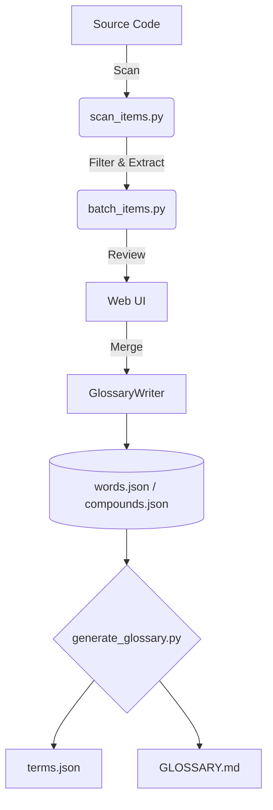

# 📖 Glossary Submodule

> 🚀 **대규모 코드베이스에서 일관된 명명 규칙을 강제하기 위한 AI 기반의 자동화된 용어 사전 시스템**

**🌐 언어 (Languages):**
- 🇺🇸 [English](README.md)
- 🇰🇷 한국어 (Current)
- 🇯🇵 [日本語](README.ja.md)
- 🇨🇳 [中文](README.zh.md)

---

## ❓ 왜 필요한가요?

**Glossary 서브모듈**은 대규모 시스템에서 식별자 명명의 불일치를 제거하기 위해 설계된 구조적인 **단어(word) 기반 명명 시스템**입니다.

다음과 같이 임의의 명명을 허용하는 대신:
```diff
- get_position
- fetch_position
- load_position
```

**단일 기준 개념**을 정의하고:
```json
{ "id": "position" }
```

일관된 사용을 엄격하게 **강제(Enforce)**합니다:
```diff
+ get_position
```

> **✨ 황금률 (The Golden Rule):** 모든 식별자는 사전에 통제되고 등록된 어휘만으로 구성되어야 합니다.

---

## 🎯 시스템의 가치

실제 대규모 개발 환경에서 발생하는 문제들:
- ❌ 시간이 지남에 따라 명명 규칙이 일관성을 잃음.
- ❌ AI 코드 생성 도구가 중복되거나 무의미한 개념을 코드에 유입시킴.
- ❌ 코드 네비게이션과 구조 파악이 어려워짐.
- ❌ 팀원 간 용어 혼동으로 커뮤니케이션 비용 증가.

이 시스템은 다음과 같은 방법으로 문제를 해결합니다:
- 🔒 공통 어휘망(`words.json`) 사용 **강제**.
- 🤖 AI 에이전트가 일관되고 결정론적인 코드를 생성하도록 **가이드**.
- 🛡️ 코드가 병합되기 전 식별자의 유효성을 자동으로 **검증**.
- 🚫 아키텍처 전반에 걸쳐 중복된 명명 패턴이 생기는 것을 **방지**.

---

## 👥 대상 사용자

### 🟢 도입을 권장하는 경우
- 규모가 크거나 장기간 유지보수해야 하는 시스템을 개발 중인 경우.
- AI 코딩 도구(Codex, Claude, Gemini)를 적극적으로 활용하는 경우.
- 아키텍처 상 명명 규칙의 일관성이 매우 중요한 경우.
- 개발팀 전체가 사용하는 도메인 용어를 표준화하고 싶은 경우.

### 🔴 도입이 불필요한 경우
- 수명이 짧은 소규모 스크립트.
- 명명 복잡도가 낮은 1인 개발 프로젝트.
- 명명의 일관성이나 엄격한 구조적 규칙에 큰 관심이 없는 경우.

---

## 🧩 핵심 개념

이 시스템은 3개의 핵심 파일과 안전한 데이터 변경 메커니즘을 기반으로 동작합니다:

| 파일 | 목적 | 편집 방법 |
| --- | --- | --- |
| 🧱 `words.json` | 원자 단위의 기본 단어 | `GlossaryWriter` / 웹 UI |
| 🧬 `compounds.json` | 특수 복합어 및 공인 약어 | `GlossaryWriter` / 웹 UI |
| 📜 `terms.json` | 자동 생성되는 표준 인덱스 | **읽기 전용 (수동 편집 금지)** |

> [!WARNING]
> **데이터 무결성 규칙:** `words.json`이나 `compounds.json`을 텍스트 편집기로 직접 수정하지 마세요. 모든 변경 사항은 유효성 검증과 자동 백업을 위해 반드시 `core/writer.py`(`GlossaryWriter`)를 거쳐야 합니다.

### 파생형 (Variants)
사전에 불필요한 단어가 난립하는 것을 막기 위해, 파생 형태는 독립적인 단어로 등록하지 않고 원본 단어(root)의 **파생형(variant)**으로 등록합니다.
- **복수형 (Plurals)**: 단수형 명사에 종속됩니다 (예: `order`의 복수형으로 `orders` 등록).
- **약어 (Abbreviations)**: 복합어(compound)의 일부로 등록됩니다.
- **동사 변형 (Verb Forms)**: 과거형이나 형용사형(예: `reached`)은 원형 동사(`reach`)에 종속됩니다.

---

## 🏗️ 아키텍처



---

## 🚀 빠른 시작

환경 설정이 완료된 후, 다음 명령어를 통해 사전을 검증하고 생성할 수 있습니다:

```bash
# 규칙 검증 및 terms.json 생성
python glossary/bin/run.py

# 특정 식별자가 사전에 부합하는지 검증
python glossary/generate_glossary.py check-id kill_switch
```

---

## 🖥️ 웹 UI

보다 안전하고 시각적인 관리를 위해 내장된 웹 서버를 실행하세요:

```bash
python glossary/web/server.py
```
> 👉 접속: [http://localhost:5000](http://localhost:5000)

**웹 UI의 주요 기능:**
* 👀 소스 코드 배치 스캔 결과 검토.
* ✍️ JSON 문법 오류 걱정 없이 안전하게 새 단어 등록.
* 🗃️ 사전 데이터를 동적으로 관리 및 검색.

---

## 🔄 단어 등록 흐름

1. **검증 (Test)**: 새로 사용할 식별자를 검사합니다 (`check-id`).
2. **식별 (Identify)**: 사전에 누락된 단어를 확인합니다.
3. **등록 (Register)**: 웹 UI나 CLI auto 모드를 통해 새 단어를 추가합니다.
4. *(선택)* **복합어 등록 (Register compound)**: 특수한 조건에 해당하는 경우 복합어를 추가합니다.
5. **생성 (Generate)**: 최종 사전을 갱신합니다.

---

## 🧠 자동 보완 및 코드 스캔

### 사전 정보 자동 보완
새로운 단어가 등록되면, 내장된 AI 파이프라인(`wikt_sense.py`)을 사용해 정의와 다국어 번역을 자동으로 채워 넣을 수 있습니다:

```bash
python glossary/bin/enrich_items.py
```

자동 보완은 다음과 같은 엄격한 정책을 따릅니다:
1. 📖 **사전 우선 (Dictionary first):** 신뢰할 수 있는 외부 사전 API를 우선적으로 참조합니다.
2. 🤖 **AI 대체 (AI fallback):** 사전 조회가 실패하면 AI를 이용해 개념을 추론합니다.
3. 🛡️ **비파괴적 업데이트 (Non-destructive):** 이미 작성된 번역이나 의미는 절대 덮어쓰지 않습니다.

### 코드 스캔
프로젝트 내에서 미등록 단어를 찾으려면 코드 스캔 기능을 사용하세요. 스캔 대상은 `.scan_list`(허용 목록)와 `.scan_ignore`(제외 목록) 파일을 통해 디렉토리와 확장자를 세밀하게 제어할 수 있습니다.

```bash
python glossary/bin/scan_items.py
```

---

## 📐 설계 원칙

* 🧱 **단어 우선 (Word-first):** 용어가 아닌 원자 단위의 단어에 집중합니다.
* 🔎 **사실 기반 (Dictionary → AI):** AI의 환각(hallucination)보다 검증된 사실(Ground truth)을 우선합니다.
* 🛡️ **비파괴적 업데이트:** 기존 데이터를 보호하는 안전한 자동화를 지향합니다.
* 📘 **개념 중심 설명:** 구현 방법론(how)이 아닌 개념(what)을 정의합니다.
* ⚖️ **일관성 > 유연성:** 엄격한 규칙이 예측 가능한 튼튼한 시스템을 만듭니다.
