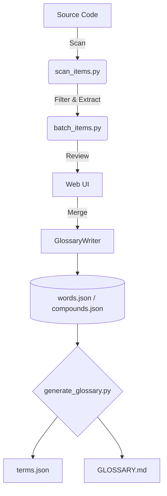

# 📖 Glossary Submodule

> 🚀 **A self-evolving glossary system powered by AI, designed to enforce consistent naming across large-scale codebases.**

**🌐 Languages:**
- 🇺🇸 English (Current)
- 🇰🇷 [Korean](README.ko.md)
- 🇯🇵 [日本語](README.ja.md)
- 🇨🇳 [中文](README.zh.md)

---

## ❓ What is this?

The **Glossary Submodule** is a structural **word-level naming system** designed to eliminate inconsistency in identifiers across large-scale systems.

Instead of allowing arbitrary naming like:
```diff
- get_position
- fetch_position
- load_position
```

You define a **single base concept**:
```json
{ "id": "position" }
```

And strictly enforce consistent usage:
```diff
+ get_position
```

> **✨ The Golden Rule:** All identifiers must be composed entirely from a controlled, pre-registered vocabulary.

---

## 🎯 Why this matters

In real-world, large-scale systems:

- ❌ Naming becomes inconsistent over time.
- ❌ AI-generated code introduces duplicate and rogue concepts.
- ❌ Code navigation becomes harder.
- ❌ Team communication breaks down.

This system solves those problems by:

- 🔒 **Enforcing** a shared vocabulary (`words.json`).
- 🤖 **Guiding** AI agents to generate consistent, deterministic code.
- 🛡️ **Validating** identifiers automatically before they merge.
- 🚫 **Preventing** duplicate naming patterns across the architecture.

---

## 👥 Audience

### 🟢 Who should use this?
This system is especially powerful if:
- You are building a large or long-lived system.
- You actively use AI coding tools (Codex, Claude, Gemini).
- Naming consistency is a critical asset for your architecture.
- You want to standardize terminology across a development team.

### 🔴 When NOT to use this?
You probably don’t need this if:
- Your project is a small, short-lived script.
- You are working solo without naming complexity.
- You don’t care about naming consistency or strict structural rules.

---

## 🧩 Core Concept

The ecosystem relies on three foundational files and a robust editing mechanism:

| Component | Purpose | Editability |
| --- | --- | --- |
| 🧱 `words.json` | Atomic building blocks. | `GlossaryWriter` / Web UI |
| 🧬 `compounds.json` | Special cases & official acronyms. | `GlossaryWriter` / Web UI |
| 📜 `terms.json` | Auto-generated standard index. | **Read-only** |

> [!WARNING]
> **Data Integrity Rule:** Do not manually edit `words.json` or `compounds.json`. All edits MUST go through the `core/writer.py` (`GlossaryWriter`) to ensure proper validation and automatic backup generation.

### Variants
To prevent cluttering the dictionary with redundant entries, derivative forms are registered as **variants** attached to the root word, rather than as independent words. For instance:
- **Plurals**: Registered under the singular noun (e.g., `orders` is a plural variant of `order`).
- **Abbreviations**: Registered as part of a compound term.
- **Verb Forms**: Past tense or adjective forms (e.g., `reached`) belong to the root verb (`reach`).

---

## 🏗️ Architecture



---

## 🚀 Quick Start

Ensure your environment is set up, then you can validate and generate your glossary in one go:

```bash
# Validate rules and generate terms
python glossary/bin/run.py

# Check a specific identifier against the dictionary
python glossary/generate_glossary.py check-id kill_switch
```

---

## 🖥️ Web UI

For a safer, visual management experience, start the built-in server:

```bash
python glossary/web/server.py
```
> 👉 Go to: [http://localhost:5000](http://localhost:5000)

**Use the UI for:**
* 👀 Reviewing batch scan results.
* ✍️ Registering new words safely without JSON syntax errors.
* 🗃️ Managing glossary entries dynamically.

---

## 🔄 Word Registration Flow

1. **Test** your identifier (`check-id`).
2. **Identify** any missing words.
3. **Register** new words (via Web UI or CLI auto mode).
4. *(Optional)* **Register** compound terms for special cases.
5. **Generate** the final glossary.

---

## 🧠 Auto Enrichment & Code Scanning

### Enriching Vocabulary
Once words are registered, you can automatically flesh out their definitions and multi-language translations using the built-in AI pipeline (`wikt_sense.py`):

```bash
python glossary/bin/enrich_items.py
```

Enrichment follows a strict, safe policy:
1. 📖 **Dictionary first:** Reliable definitions from external dictionary APIs.
2. 🤖 **AI fallback:** Smart concept generation if dictionaries fail.
3. 🛡️ **Non-destructive updates:** Existing translations/meanings are never overwritten.

### Scanning Code
To discover unregistered words used in your project, use `.scan_list` (allowlist) and `.scan_ignore` (blocklist) to configure exactly which directories and files should be scanned.

```bash
python glossary/bin/scan_items.py
```

---

## 📐 Design Principles

* 🧱 **Word-first, not term-first:** Focus on atomic elements.
* 🔎 **Dictionary → AI fallback:** Ground truth over hallucination.
* 🛡️ **Non-destructive updates:** Safe automation.
* 📘 **Concept-based descriptions:** Define the "what", not the "how".
* ⚖️ **Consistency over flexibility:** Strict rules create predictable systems.