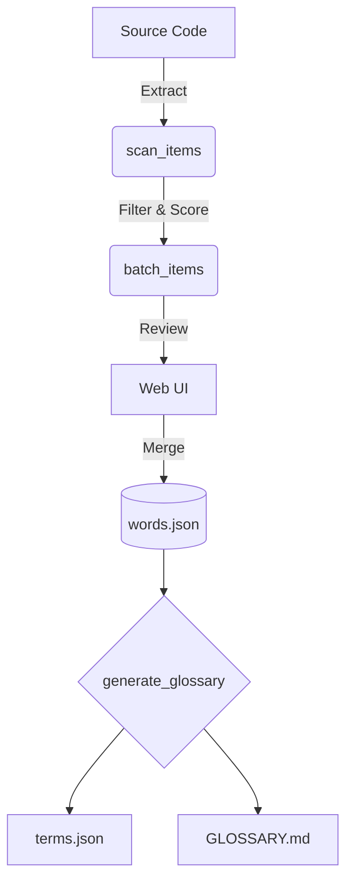

# 📖 BomTS Glossary

> 基于单词的命名规范系统，支持AI自动补全与多语言能力。

**🌐 语言 (Languages):**
- 🇺🇸 [English](README.md)
- 🇰🇷 [한국어](README.ko.md)
- 🇯🇵 [日本語](README.ja.md)
- 🇨🇳 中文 (Current)

---

## ❓ 这是什么？

**BomTS Glossary** 是一个结构化的**基于单词（word）的命名系统**，旨在消除大规模系统中标识符命名的不一致性。

与其允许像这样的随意命名：
```diff
- get_position
- fetch_position
- load_position
```

不如首先定义一个基础的**“单词（概念）”**：
```json
{ "word": "position" }
```

然后严格执行一致的用法：
```diff
+ get_position
```

> **✨ 黄金法则 (The Golden Rule):** 所有标识符都必须完全由经过控制和注册的词汇表（Vocabulary）组成。

---

## 🎯 为什么这很重要？

在实际的大规模系统中：

- ❌ 随着时间推移，命名变得不一致。
- ❌ AI代码生成工具经常引入重复而随意的概念。
- ❌ 代码内测与导航变得困难。
- ❌ 团队间的沟通产生障碍（认知不同步）。

该系统通过以下方式从根本上解决这些问题：

- 🔒 **强制** 使用共享词汇表 (`words.json`)。
- 🤖 **引导** AI Agent 生成一致且确定性的代码。
- 🛡️ **自动验证** 合并前的标识符规范性。
- 🚫 **防止** 在整个系统架构中出现重复的命名模式。

---

## 👥 适用对象

### 🟢 谁应该使用它？
如果符合以下条件，该系统将非常有效：
- 你正在构建一个大型或长期维护的系统。
- 你积极使用AI编码辅助工具（Codex, Claude, Gemini等）。
- 命名的统一性对你们的系统架构至关重要。
- 你们希望在整个开发团队中标准化业务概念和术语。

### 🔴 什么时候不需要？
以下情况可能不需要使用：
- 只是小型的短期项目（如简单的脚本）。
- 独自开发且没有复杂的命名需求。
- 你不关心命名的强一致性或严格结构规则。

---

## 🧩 核心概念

该生态系统依赖于三个基础文件：

| 文件 | 作用 | 是否可编辑 |
| --- | --- | --- |
| 🧱 `words.json` | 原子级别的基础单词 | 手动修改 / Web UI |
| 🧬 `compounds.json` | 特殊的复合词或首字母缩写 | 手动修改 / Web UI |
| 📜 `terms.json` | 自动生成的标准词汇表 | **禁止编辑** |

> [!WARNING]  
> 所有的标识符都必须由已注册的单词构成。请勿手动修改 `terms.json`。

---

## 🏗️ 系统架构



---

## 🚀 快速开始

```bash
# 验证词汇规则并生成 glossary 文件
python glossary/bin/run.py

# 检验特定的标识符是否合规
python glossary/generate_glossary.py check-id kill_switch
```

---

## 🖥️ Web UI (可视化界面)

为提供更安全的管理体验，可以启动内置的 Web 服务器：

```bash
python glossary/web/server.py
```
> 👉 访问地址: [http://localhost:5000](http://localhost:5000)

**Web UI 的主要用途:**
* 👀 查看批处理(batch)扫描出来的结果。
* ✍️ 无需担心 JSON 语法错误，安全地注册新单词。
* 🗃️ 动态管理词汇表条目。

---

## 🔄 单词注册流程

1. **测试** 你的标识符 (`check-id`)。
2. **识别** 出任何未注册的缺失单词。
3. **注册** 新单词（通过 Web UI 或 CLI 的 Auto 模式）。
4. *(可选)* **注册** 特殊场景的复合词 (compound)。
5. **生成 (Generate)** 最终的词汇表。

> **💡 工作流示例**
> `出现新标识符` → `check-id 检验` → `发现缺失单词` → `注册该单词` → `生成词汇表` → `可以安全使用该标识符！`

---

## 🧠 自动补全 (Auto Enrichment)

当单词注册完毕后，你可以通过以下命令自动补全它们的定义与多语言翻译信息：

```bash
python glossary/bin/enrich_items.py
```

补全系统遵循严格且安全的策略：
1. 📖 **字典优先 (Dictionary first):** 优先从在线字典 API 获取可靠定义。
2. 🤖 **AI 回退 (AI fallback):** 如果字典中没有，则智能启用 AI (LLM) 获取释义与验证。
3. 🛡️ **非破坏性更新 (Non-destructive):** 原有的翻译与释义数据绝对不会被覆盖。

这确保了能以 **最小的手动工作量** 来维护 **多语言支持** 与 **可靠的词汇定义**。

---

## 📐 设计原则

* 🧱 **Word-first (基于词而不是短语):** 关注最基础的原子元素。
* 🔎 **字典 → AI 的回退策略:** 相信已知事物 (Ground truth) 胜过 AI 推理猜测。
* 🛡️ **非破坏性更新:** 安全可靠的自动化执行。
* 📘 **基于概念描述:** 解释“是什么”(What)，而不是解释如何实现 (How)。
* ⚖️ **一致性高于灵活性:** 严格的规则造就可预测的健壮系统。

---

## 📌 注意事项

> [!NOTE]  
> - **CLI 的 `auto` 模式** 会立即合并和应用批量更改，无确认提示。
> - 在处理大规模批量更新时，强烈建议使用 **Web UI** 来安全地进行审查和管理。

<br>

---
*BomTS 内部生态系统专用管理工具。*
