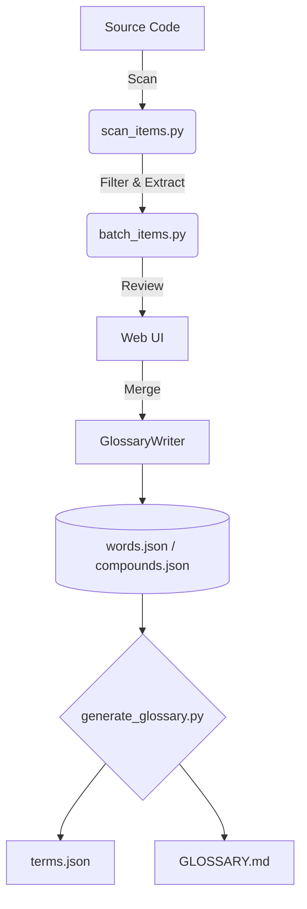

# 📖 Glossary Submodule

> 🚀 **一个由AI驱动的自动进化词汇表系统，旨在确保大规模代码库中的命名一致性。**

**🌐 语言 (Languages):**
- 🇺🇸 [English](README.md)
- 🇰🇷 [한국어](README.ko.md)
- 🇯🇵 [日本語](README.ja.md)
- 🇨🇳 中文 (Current)

---

## ❓ 这是什么？

**Glossary Submodule (词汇表子模块)** 是一个结构化的**基于单词（word）的命名系统**，旨在消除大规模系统中标识符命名的不一致性。

与其允许像这样的随意命名：
```diff
- get_position
- fetch_position
- load_position
```

不如首先定义一个基础的**“单一核心概念”**：
```json
{ "id": "position" }
```

然后严格执行一致的用法：
```diff
+ get_position
```

> **✨ 黄金法则 (The Golden Rule):** 所有标识符都必须完全由经过控制和预先注册的词汇表（Vocabulary）组成。

---

## 🎯 为什么这很重要？

在实际的大规模系统中：
- ❌ 随着时间推移，命名变得不一致。
- ❌ AI代码生成工具经常引入重复而随意的概念。
- ❌ 代码内测与导航变得困难。
- ❌ 团队间的沟通产生障碍。

该系统通过以下方式从根本上解决这些问题：
- 🔒 **强制** 使用共享词汇表 (`words.json`)。
- 🤖 **引导** AI Agent 生成一致且确定性的代码。
- 🛡️ **自动验证** 合并前的标识符规范性。
- 🚫 **防止** 在整个系统架构中出现重复的命名模式。

---

## 👥 适用对象

### 🟢 谁应该使用它？
如果符合以下条件，该系统将非常有效：
- 你正在构建一个大型或长期维护的系统。
- 你积极使用AI编码辅助工具（Codex, Claude, Gemini等）。
- 命名的统一性对你们的系统架构至关重要。
- 你们希望在整个开发团队中标准化业务概念和术语。

### 🔴 什么时候不需要？
以下情况可能不需要使用：
- 只是小型的短期项目（如简单的脚本）。
- 独自开发且没有复杂的命名需求。
- 你不关心命名的强一致性或严格的结构规则。

---

## 🧩 核心概念

该生态系统依赖于三个基础文件和一个健壮的编辑机制：

| 组件 | 作用 | 是否可编辑 |
| --- | --- | --- |
| 🧱 `words.json` | 原子级别的基础单词 | `GlossaryWriter` / Web UI |
| 🧬 `compounds.json` | 特殊的复合词与官方缩写 | `GlossaryWriter` / Web UI |
| 📜 `terms.json` | 自动生成的标准词汇表索引 | **只读 (禁止手动编辑)** |

> [!WARNING]
> **数据完整性规则 (Data Integrity Rule):** 请勿手动编辑 `words.json` 或 `compounds.json`。所有的修改都必须通过 `core/writer.py` (`GlossaryWriter`) 进行，以确保验证正确并生成自动备份。

### 变体 (Variants)
为了防止词典中充斥多余的条目，派生形式会作为**变体 (variant)** 附加到词根 (root) 上，而不是作为独立的单词注册。例如：
- **复数形式 (Plurals)**: 注册在单数名词下（例如，`orders` 是 `order` 的复数变体）。
- **缩写 (Abbreviations)**: 作为复合词 (compound) 的一部分进行注册。
- **动词形式 (Verb Forms)**: 过去式或形容词形式（如 `reached`）归属于其动词原形（`reach`）。

---

## 🏗️ 系统架构



---

## 🚀 快速开始

环境设置完成后，您可以使用以下命令一键验证并生成词汇表：

```bash
# 验证词汇规则并生成 terms 文件
python glossary/bin/run.py

# 检验特定的标识符是否符合字典要求
python glossary/generate_glossary.py check-id kill_switch
```

---

## 🖥️ Web UI (可视化界面)

为提供更安全的管理体验，可以启动内置的 Web 服务器：

```bash
python glossary/web/server.py
```
> 👉 访问地址: [http://localhost:5000](http://localhost:5000)

**Web UI 的主要用途:**
* 👀 查看批处理扫描出来的结果。
* ✍️ 无需担心 JSON 语法错误，安全地注册新单词。
* 🗃️ 动态管理词汇表条目。

---

## 🔄 单词注册流程

1. **测试 (Test)** 你的标识符 (`check-id`)。
2. **识别 (Identify)** 出任何缺失的单词。
3. **注册 (Register)** 新单词（通过 Web UI 或 CLI 的 auto 模式）。
4. *(可选)* **注册复合词 (Register compound)** 用于特殊场景。
5. **生成 (Generate)** 最终的词汇表。

---

## 🧠 自动补全与代码扫描

### 自动补全 (Enrichment)
当单词注册完毕后，你可以使用内置的 AI 管道 (`wikt_sense.py`) 自动补全它们的定义与多语言翻译信息：

```bash
python glossary/bin/enrich_items.py
```

补全系统遵循严格且安全的策略：
1. 📖 **字典优先 (Dictionary first):** 优先从在线字典 API 获取可靠定义。
2. 🤖 **AI 回退 (AI fallback):** 如果字典中没有，则智能启用 AI 获取释义。
3. 🛡️ **非破坏性更新 (Non-destructive):** 原有的翻译与释义数据绝对不会被覆盖。

### 代码扫描
要发现项目中使用了哪些未注册的单词，可以使用代码扫描功能。通过 `.scan_list`（允许列表）和 `.scan_ignore`（忽略列表）文件，您可以精确配置需要扫描的目录和文件。

```bash
python glossary/bin/scan_items.py
```

---

## 📐 设计原则

* 🧱 **Word-first (基于词而不是短语):** 关注最基础的原子元素。
* 🔎 **字典 → AI 的回退策略:** 相信已知事实 (Ground truth) 胜过 AI 幻觉猜测。
* 🛡️ **非破坏性更新:** 安全可靠的自动化执行。
* 📘 **基于概念描述:** 解释“是什么”(What)，而不是解释如何实现 (How)。
* ⚖️ **一致性高于灵活性:** 严格的规则造就可预测的健壮系统。
